## Introdución

Unha empresa de cines de Santiago solicitounos un rediseño integral da súa páxina web. Multicines Compostela ofrece unha carteleira semanal con películas de estreo, así como proxeccións de teatro e ópera. Ós usuarios deben poder consultar a dispoñible en salas e reservar a súa entrada. O cine tamén organiza festivais e ciclos con diferentes temáticas e autores, e ofrece as instalacións para a organización de diversos proxectos (presentacións de libros, concurso de curtas locais, reserva de salas para reposicións privadas...).

Multicines tamén quere comezar un blog onde poidan publicar artigos sobre diferentes temas relacionados co cine. Por exemplo, a análise  da filmografía dun director, ou o comentario sobre técnicas de grabación. Ademáis, queren dedicar un anaco á publicación de recensións sobre películas proxectadas con información das mesmas.

## Inventario de contido

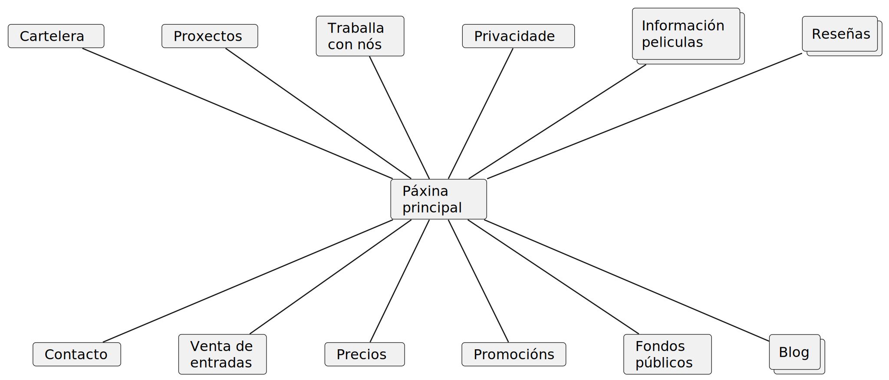

Dados os requerimentos dados pola empresa, un inventario de contido adecuado sería o seguinte:

- `Carteleira`: carteleira semanal coas peliculas que se están a proxectar neste momento.
- `Proxectos`: os diferentes proxectos que desenvolve Multicines.
- `Traballa con nós`: información para poder contactar co cinema para a creación dalgún evento ou traballar neste.
- `Información películas`: base de datos coas películas emitidas polo cinema.
- `Recensións`: conxunto de recensións sobre películas.
- `Contacto`: información da ubicación do cine.
- `Venda de entradas`: permitir aos usuarios reservar entradas.
- `Precios`: información de precios e tarifas para as sesións de cine.
- `Promocións`: información sobre promocións temporais no cinema.
- `Fondos públicos`: material cinematográfico de dominio público que se ofrece.
- `Blog`: diferentes artigos relacionados co cine.

## Arquitectura da información

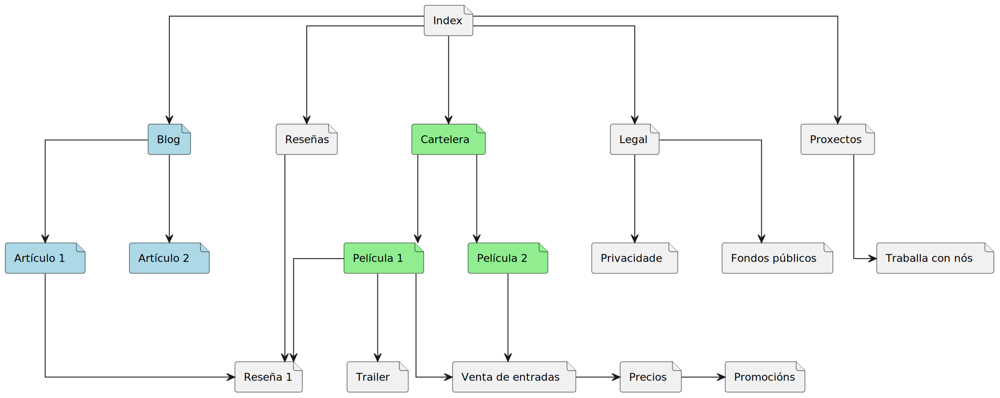

Unha vez realizado o inventario de contidos da web debemos xerarquizalos. Tras a análise detida do contexto, podemos identificar 5 categorías principais:

O apartado de **Blog**, que contén diferentes artigos, así como o de **Recensións**, que contén as recensións. Os diferentes artigos do blog poden referenciar a diferentes películas, ou recensións das mesmas. A **Carteleira** semanal recolle as diferentes películas, que asócianse con recensións e trailers. E a través das películas que se accede a venda de entradas, dende onde consúltanse precios e promocións. Dentro do apartado dos *Proxectos* pódese contactar para traballar ca sala. Por último, é necesaria unha xerarquía para a **Información de empresa**: privacidade, fondos públicos, contacto, historia...

## Casos de uso

Seleccionamos varios casos de uso representativos da páxima web que estamos a desenvolver:

### Consultar horarios da carteleira

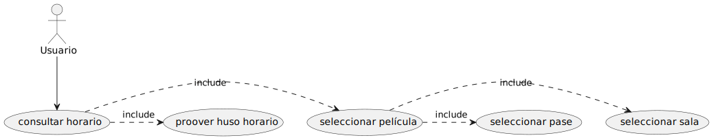

Para consultar o horario dunha película da carteleira é necesario comprobar en qué sala e en que pase estase estáse a proxectar. Coa información do huso horario pode completarse ese caso de uso.

### Ler recensión

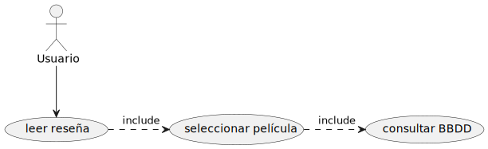

Para poder leer unha recensión debe consultarse a base de datos asociada a dita película.

### Enviar preguntas

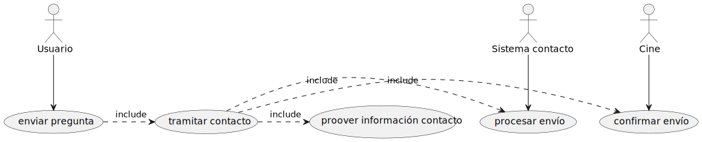

O usuario pode enviar preguntas, pero para tramitar o contacto débese proveer de información de contacto. Unha vez realizado isto, o sistema de contacto pode procesar o envío, e o cinema pode confirmar o envío.

### Reservar entradas

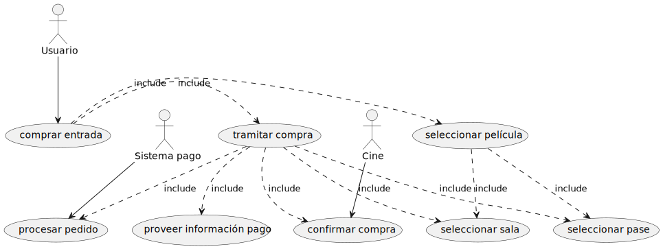

Para poder reservar unha entrada o usuario deberá seleccionar a película en cuestión, así como a sala e o pase ao que quere asistir. Á hora de tramitar a reserva, o sistema terá en conta información previa para informar ó usuario da tarifa que terá que abonar ó chegar ó cine. O resto do caso de uso é homólogo ao anterior.

## Mapa Web

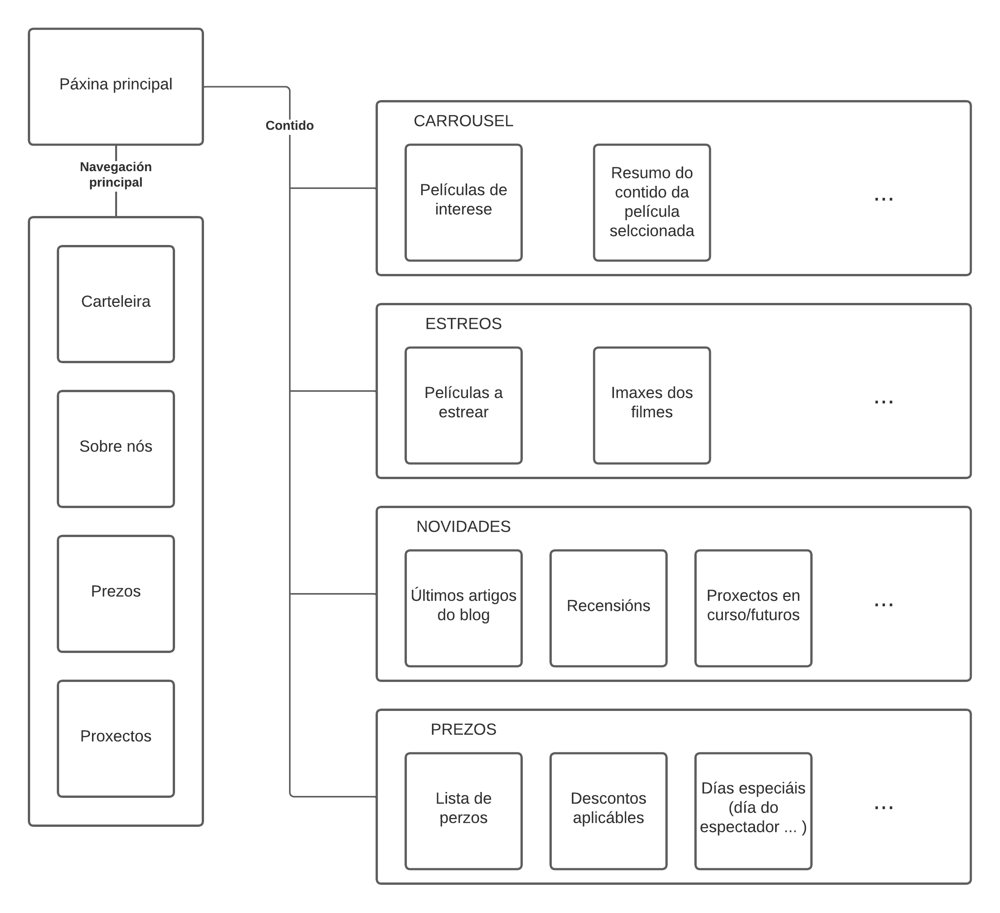

Previo ao deseño do noso prototipo é necesario establecer un mapa web para ter claro como vamos a distribuir a información na páxina.

O contido relevante que debe amosarse na páxina principal da web é o de maior interés para o usuario. Por eso deben amosarse as películas de relevancia na carteleria, posiblemente nun formato de carrousel. É importante tamén mostrar de forma simple os carteis dos próximos estreos, así como un resumo das novidades do cine: artigos, reseñas, proxectos... O listado de prezos tamén debería atoparse aquí para facilitar as consultas rápidas.

Dende a páxina principal pódese acceder a diferentes subpáxinas con información máis específica. Trátase da información corporativa do cine (contacto, localización, razón social...), carteleira detallada, proxectos en curso, así como un listado máis extenso sobre as tarifas do cinema.

## Deseño do prototipo

### Consideracións previas

| 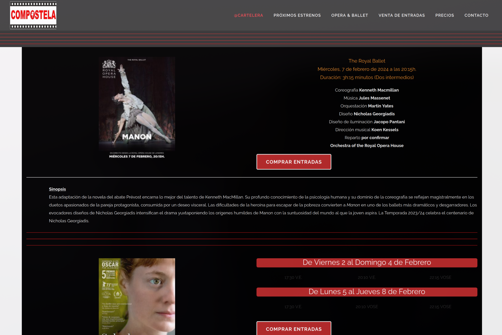 | 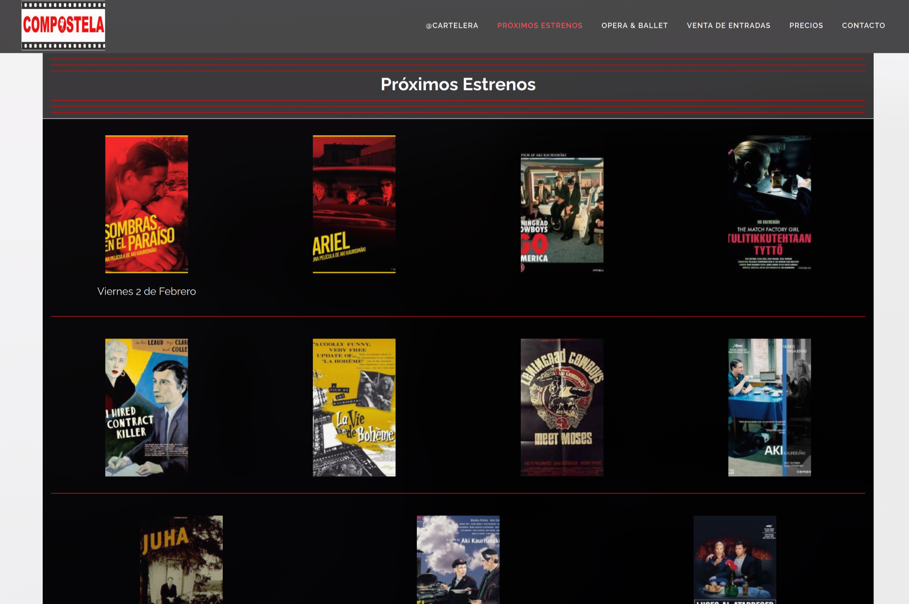 |
| --- | --- |
| 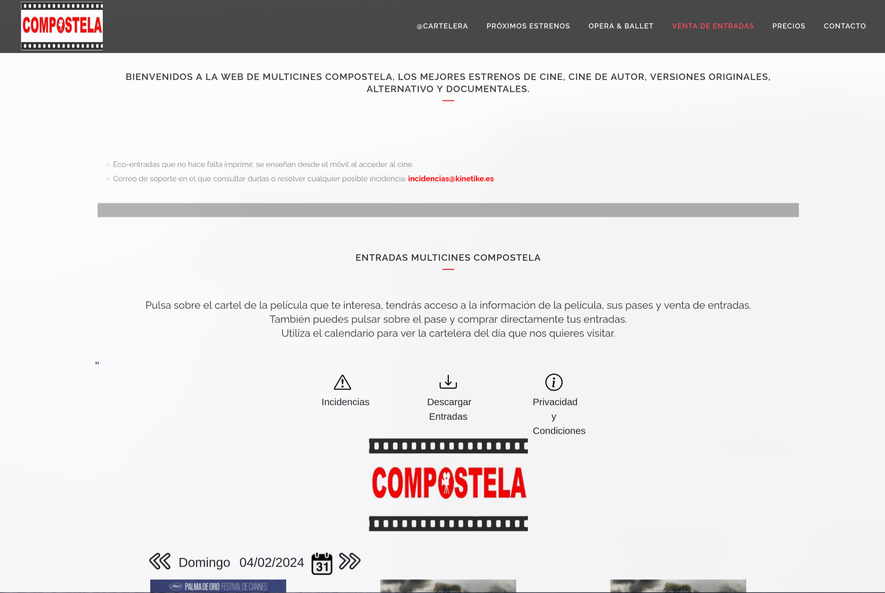 | 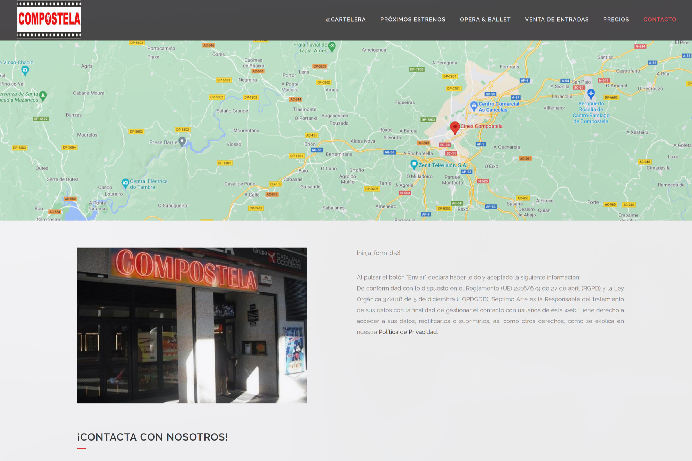 |

Podemos ver que a [páxina actual](https://multicinescompostela.com/) de Multicines Compostela é moi recargada, pouco clara, non ten coherencia de colores e a navegación non é moi clara. Queremos coller as ideas base e as necesidades que teñen e transformalas nunha web accesible e visualmente agradable.

Comezando pola barra superior, hai demasiadas categorías de navegación que ademáis non son relevantes. Na páxina principal o contraste é demasiado baixo e a información relevante está moi abaixo. Cada película ocupa case a ventana enteira do navegador. A páxina de Próximos estrenos só ten unha imaxe de cada cartel, sen título, e non están vinculados a información sobre a película.

Na páxina para comprar entradas hai tanta información irrelevante que non podes ver sequera a carteleira sen deslizar cara abaixo. Hai que facer clicks innecesarios para seleccionar as sesións. A páxina de precios non é moi profesional e non ten unha táboa clara cos precios exactos por rango de idade / promoción. Da páxina de contacto gústanos o mapa, aínda que podía ter máis zoom, mais o formulario está roto, e de novo a colocación da información fai que sexa necesario deslizar moito cara abaixo.

Ademáis, a páxina é moi lenta de navegar, por unha mezcla de velocidade de carga, librerías moi grandes e transiciones moi longas. Tamén é ridículo ter un footer que ocupe a metade da páxina simplemente por problemas de redimensionamento dos logos.

### Sketch

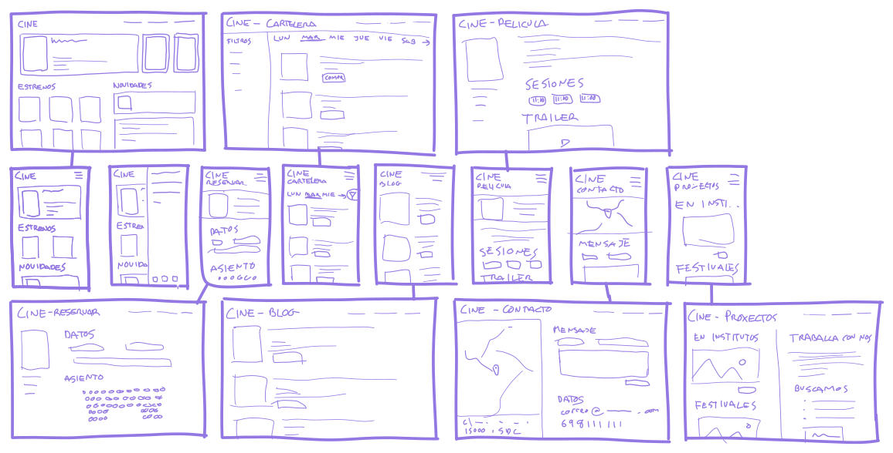

A idea do rediseño é facer unha interfaz accesible e responsiva que conteña a información importante sen ter que desplazarse moito. Creamos unha páxina principal cun carrousel cos estrenos máis relevantes (que permite incluír máis información sen ocupar espazo). Despois facemos dous columnas, unha para o resto de estreos, e outra con novidades do blog, promocións ou eventos.

No apartado de carteleira facemos unha columna de filtros que permita seleccionar películas, ópera, ballet... permitindo xuntar todo nun mesmo sitio. Ademáis, engadimos outros filtros últiles como duración ou idade. A parte dereita é unha lista de películas que coincidan con este filtro e permite elixir o día da proxección.

Temos unha páxina de información sobre a película, que inclúe a descripcións, as sesións e o trailer, e enlaces á recensión de habelos. Pulsando nas sesións automáticamente pasamos a reservar entradas. Esta é unha páxina sinxela que pide os datos de contacto e o número de entradas. O cine non ten butacas numeradas e págase na porta, polo que non é necesario indicar máis.

O blog ten unha lista sinxela, parecida á das películas, cos artigos e un pequeno estracto de cada un. A páxina do artigo e sinxela e depende de cada un deles.

Na páxina de contacto movemos ó mapa a columna esquerda, creando unha linguaxe de deseño uniforme ca columna de filtros na carteleira. Poñemos o formulario de contacto o primeiro para que sexa accesible, e os datos despois.

A páxina de proxectos pode ter dúas columnas iguais, unha coa lista de iniciativas como cine nos institutos e festivais, e outra coa información para traballar có cine.

Todos os deseños están feitos con unha distribución flex en mente e podense adaptar fácilmente a unha interfaz móbil cambiando a dirección dos obxectos. O menú escóndese nunha hamburguesa e os filtros nun botón específico. As listas horizontales agora son verticais e pode facerselles scroll para ver o resto.

### Wireframe

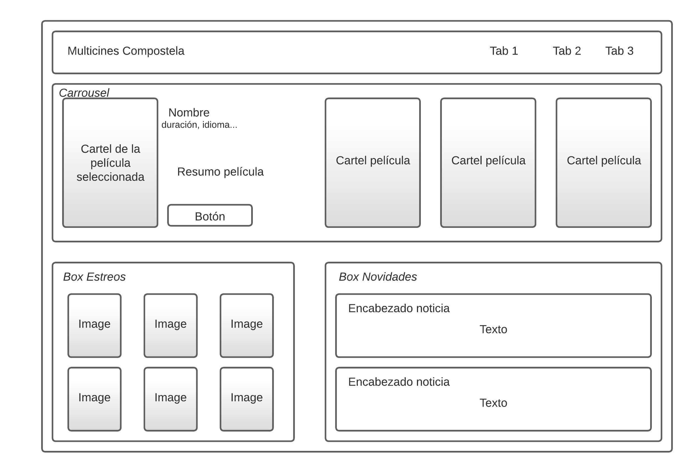

O noso seguinte paso é realizar un wireframe para ter una idea  previa a facer o mockup. Este serviranos de esqueleto para construir un deseño final da nosa páxina web.

### Mockup

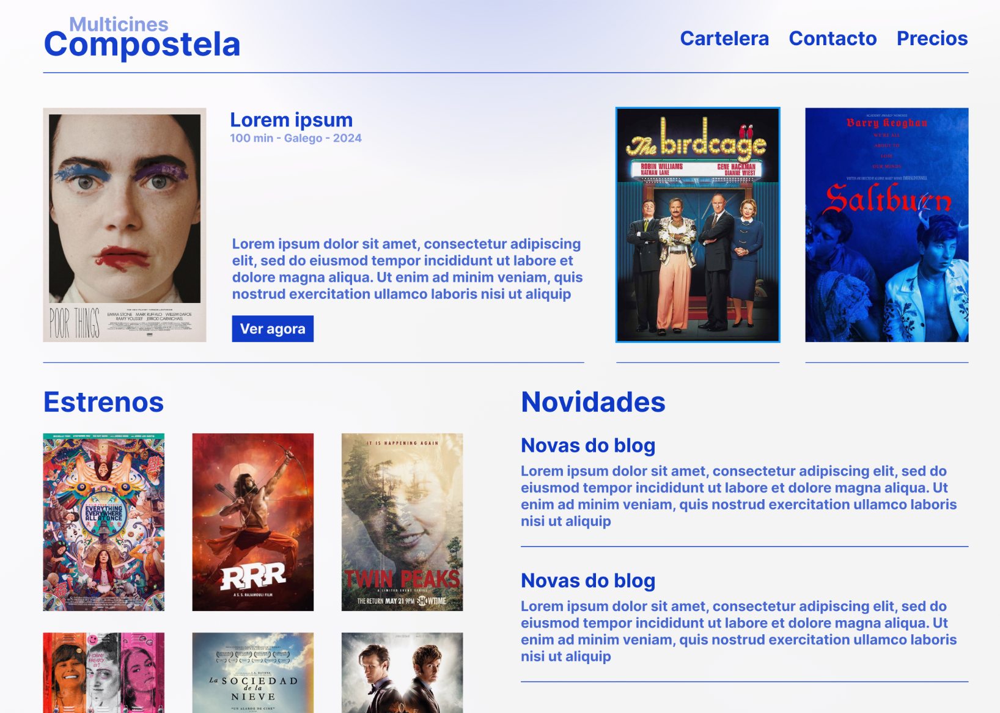

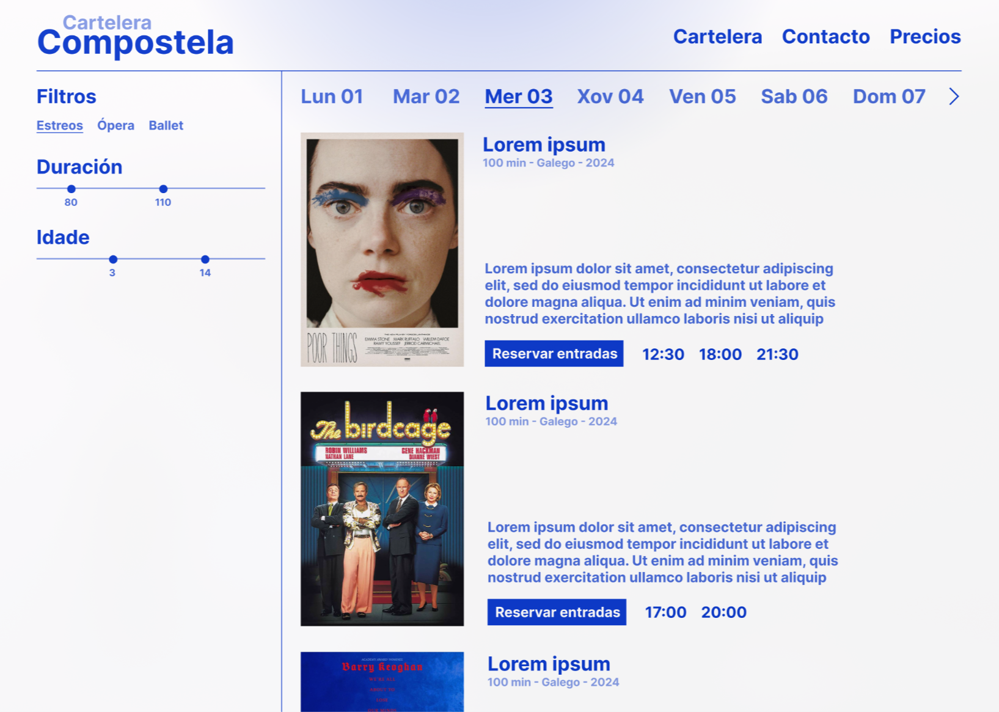

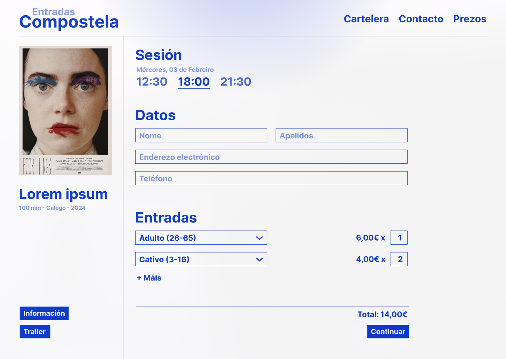

Neste mockup plantexamos un número reducido de páxinas finais polas que comezará o desarroio. Traballando cunha metodoloxía áxil é moi probable que cuestións importantes do deseño cambien por requisitos que surxan no proxecto, polo que fumos conservadores co traballo en prototipos finais. Creamos mockups das páxinas máis importantes e do caso de uso principal: ver a carteleira e reservar entradas, por ser esta a funcionalidade base que sí ou sí ten que ter a web e por onde comezaremos a traballar.

### Storyboard

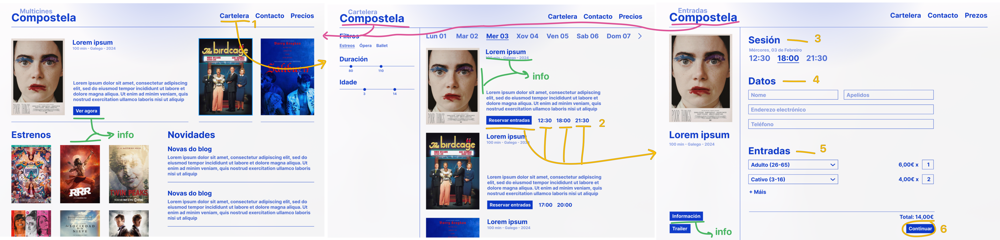

Decidimos incluír un storyboard para a reserva de entradas. A liña amarilla representa os pasos a seguir. Primeiro, accedese á carteleira (1), e alí elixese unha película (2). Pode utilizarse tanto o botón de reservar entradas coma directamente os horarios da sesión. Unha vez na páxina de reserva elixese a sesión (3) (estará premarcada se xa se seleccionou), introdúcense os datos (4) e especifícase o número e tipo de cada entrada (5). Finalmente, prémese o botón de "Continuar" (6) que confirmará a reserva.

En calqueira momento pode volverse ó inicio facendo click no título "Compostela" (liña rosa). Outra maneira de acceder a esta páxina de entradas é ir ós detalles da película (en múltiples localizaciones, liña verde), e dende alí premer o botón de "Reservar entradas".

## Estrutura de arquivos

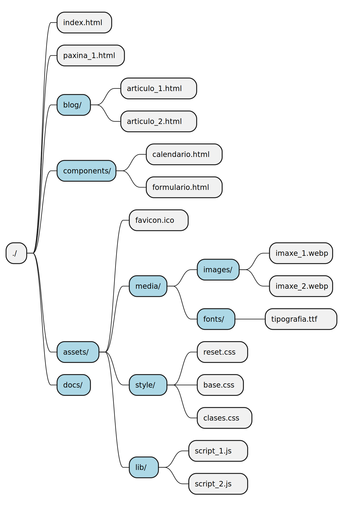{ width=350px }

- `index.html`: páxina base da web (dirección /)
- `paxina*.html`: outras páxinas, por exemplo, formulario de contacto ou lista de sesións
- `blog/`: contén os artículos do blog da web
- `components/`: pequenos arquivos html que poden ser reutilizados en múltiples páxinas
- `assets/`: arquivos externos ó hipertexto
    - `media/`: todo o contido multimedia necesario para a aplicación
        - `images/`: imaxes (pode ter subcarpetas para unha mellor organización)
        - `fonts/`: tipografías
    - `style/`: follas de estilo css
        - `reset.css`: un estilo homoxeneo de css para tódolos navegadores con valores por defecto razoables
        - `base.css`: estilo global para cada selector (p, h1, img...)
        - `classes.css`: clases particulares con estilo propio (tarxetas, diapositivas...)
    - `lib/`: scripts para funcionalidade interactiva con javascript
- `docs/`: todos os arquivos de documentación e planificación (non pertencentes á web)
