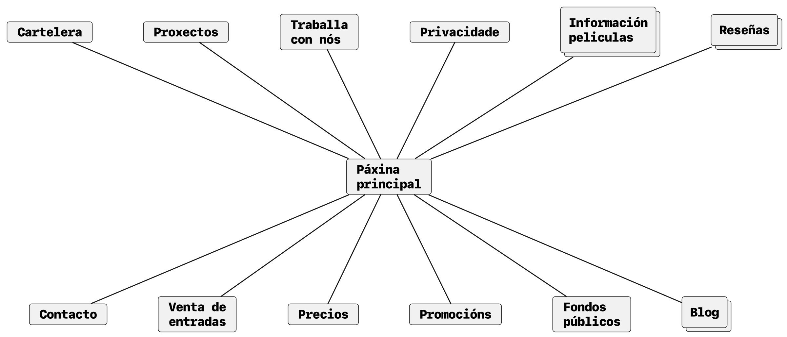
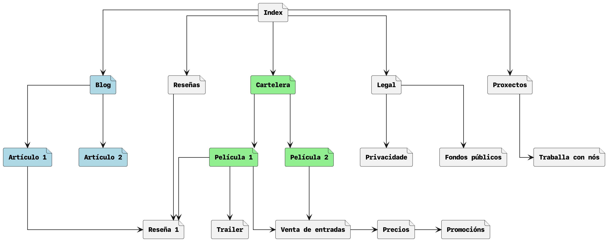
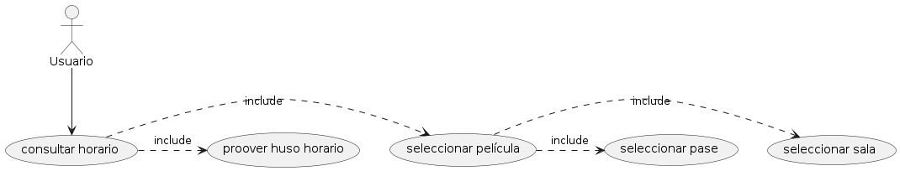
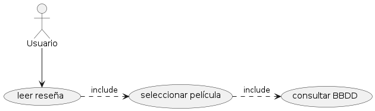
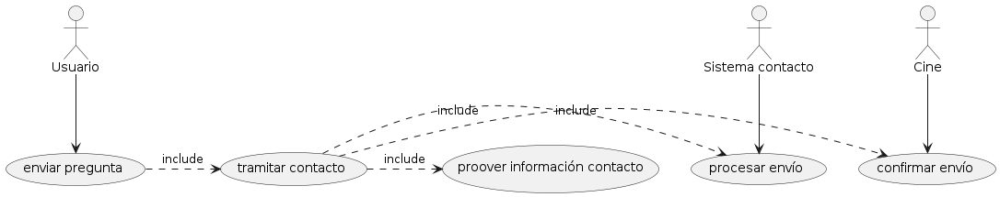
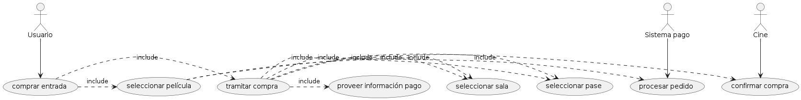
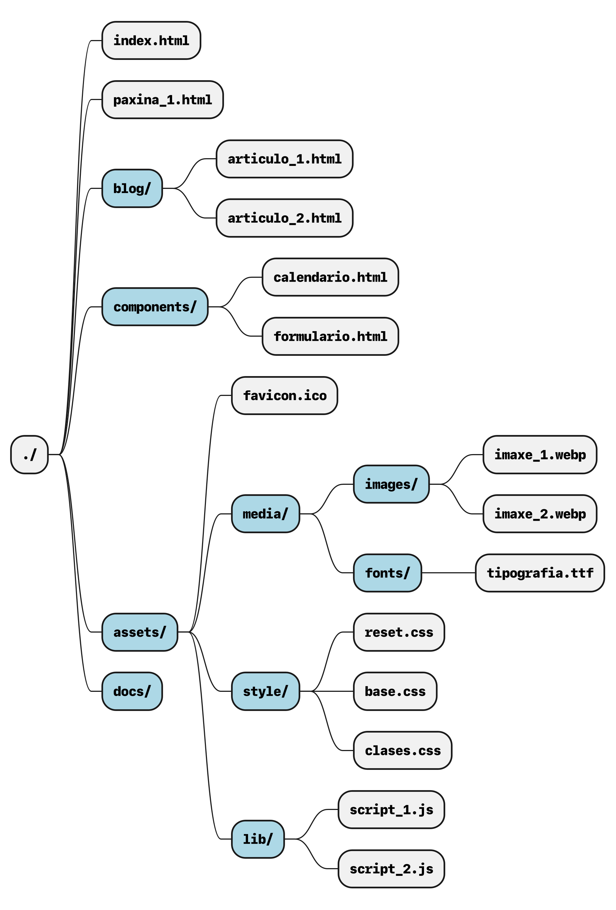

# Introdución

Unha empresa de cines de Santiaho solicitounos a creación da sua nova páxina web. Dito cine ofrece una carteleria semanal con películas de estreo, queréndoselle ofrecer ao usuario a posibilidade de consultar a cabida dispoñible e de reservar a súa entrada. O cine realiza tamén ciclos en base a diferentes temáticas e autores, e ofrece as instalacións para a organización de diversos proxectos (presentacións de libros, concurso de curtas locais, reserva de salas para reposicións privadas...).

A empresa tamén propón un apartado de blog donde poidan publicar artigos sobre diferentes tópicos como, por exemplo, a análise  da filmografía dun director, ou o comentario sobre técnicas de grabación. Ademáis quérese dedicar un anaco á publicación de recensións sobre películas proxectadas con información das mesmas.

Polo tanto, esta empresa de cine require dunha páxima web onde poida mostrarlle aos usuarios a carteleisa semanal coa opción de reservar entradas e consultas a cabida. Unha sección para os proxectos actuais do cine, e tamén para o blog. Ademáis deberá contar cunha base de datos con información de películas proxectadas, amosando información e recensións de crítios e de clientes da mesma.

# Inventario de contido

Dados os requerimentos dados pola empresa, un inventario de contido adecuado sería o seguinte:
- `Carteleira`: carteleira semanal coas peliculas que se están a proxectar neste momento.
- `Proxectos`: os diferentes proxectos que desenvolve o cine.
- `Traballa con nós`: información para poder contactar co cinema para a creación dalgún evento.
- `Información películas`: base de datos coas películas emitidas polo cinema.
- `Recensións`: conxunto de recensións sobre películas.
- `Contacto`: información da ubicación do cine.
- `Venda de entradas`: permitir aos usuarios reservar entradas.
- `Precios`: información de precios e tarifas para as sesións de cine.
- `Promocións`: información sobre promocións temporais no cinema.
- `Fondos públicos`: material cinematográfico de dominio público que se ofrece.
- `Blog`

# Arquitectura da información

Unha vez realizado o inventario de contidos da web debemos xerarquizalos. Tras a análise detida do nos contexto, podemos identificar 5 categorías principais. 

O apartado de Blog, no se se conteñen diferentes artigos, así como o de Recensións, que contén as recensións. Os diferentes artigos do blog poden referenciar a diferentes películas, ou recensións das mesmas. 

A carteleria semanal recolle as diferentes películas, que asócianse con recensións e trailers. E a través das películas que se accede a venda de entradas, dende onde consúltanse precios e promocións.

Dentro do apartado dos proxectos pódese contactar para traballar co cinema.

Por último, é necesaria unha xerarquía para a información de empresa: privacidade, fondos públicos, contacto, historia...

# Casos de uso

Seleccionamos varios casos de uso representativos da páxima web que estamos a desenvolver:

## Consultar horarios da carteleira

Para consultar o horario dunha película da carteleira é necesario comprobar en qué sala e en que pase estase estáse a proxectar. Coa información do huso horario pode completarse ese caso de uso.

## Ler recensión

Para poder leer unha recensión debe consultarse a base de datos asociada a dita película.

## Enviar preguntas

O usuario pode enviar preguntas, pero para tramitar o contacto débese proveer de información de contacto. Unha vez realizado isto, o sistema de contacto pode procesar o envío, e o cinema pode confirmar o envío.

## Comprar entradas

Para poder comprar unha entrada o usuario deberá seleccionar a película en cuestión, así como a sala e o pase ao que quere asistir. Á hora de tramitar a compra, o sistema terá en conta información previa para calcular a tarifa. O resto do caso de uso é homólogo ao anterior.

# Estrutura de arquivos

- `index.html`: Páxina base da web (dirección /)
- `paxina*.html`: Outras páxinas, por exemplo, formulario de contacto ou lista de sesións
- `blog/`: Contén os artículos do blog da web
- `components/`: Pequenos arquivos html que poden ser reutilizados en múltiples páxinas
- `assets/`: Arquivos externos ó hipertexto
    - `media/`: Todo o contido multimedia necesario para a aplicación
        - `images/`: Imaxes (pode ter subcarpetas para unha mellor organización)
        - `fonts/`: Tipografías
    - `style/`: Follas de estilo css
        - `reset.css`: Un estilo homoxeneo de css para tódolos navegadores con valores por defecto razoables
        - `base.css`: Estilo global para cada selector (p, h1, img...)
        - `classes.css`: Clases particulares con estilo propio (tarxetas, diapositivas...)
    - `lib/`: Scripts para funcionalidade interactiva con javascript
- `docs/`: Todos os arquivos de documentación e planificación (non pertencentes á web)
