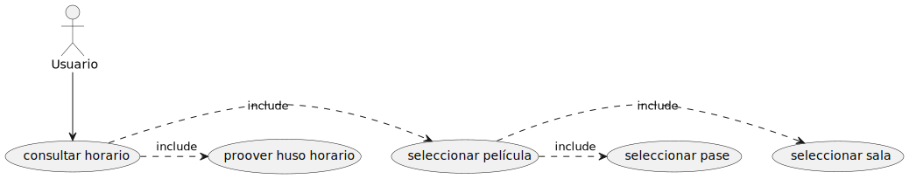
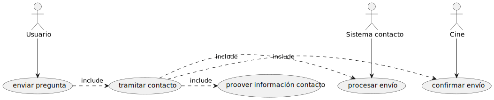

## Introdución

Unha empresa de cines de Santiago solicitounos un rediseño integral da súa páxina web. Multicines Compostela ofrece unha carteleira semanal con películas de estreo, así como proxeccións de teatro e ópera. Ós usuarios deben poder consultar a dispoñible en salas e reservar a súa entrada. O cine tamén organiza festivais e ciclos con diferentes temáticas e autores, e ofrece as instalacións para a organización de diversos proxectos (presentacións de libros, concurso de curtas locais, reserva de salas para reposicións privadas...).

Multicines tamén quere comezar un blog onde poidan publicar artigos sobre diferentes temas relacionados co cine. Por exemplo, a análise  da filmografía dun director, ou o comentario sobre técnicas de grabación. Ademáis, queren dedicar un anaco á publicación de recensións sobre películas proxectadas con información das mesmas.

## Inventario de contido

Dados os requerimentos dados pola empresa, un inventario de contido adecuado sería o seguinte:

- `Carteleira`: carteleira semanal coas peliculas que se están a proxectar neste momento.
- `Proxectos`: os diferentes proxectos que desenvolve Multicines.
- `Traballa con nós`: información para poder contactar co cinema para a creación dalgún evento ou traballar neste.
- `Información películas`: base de datos coas películas emitidas polo cinema.
- `Recensións`: conxunto de recensións sobre películas.
- `Contacto`: información da ubicación do cine.
- `Venda de entradas`: permitir aos usuarios reservar entradas.
- `Precios`: información de precios e tarifas para as sesións de cine.
- `Promocións`: información sobre promocións temporais no cinema.
- `Fondos públicos`: material cinematográfico de dominio público que se ofrece.
- `Blog`: diferentes artigos relacionados co cine.

## Arquitectura da información

Unha vez realizado o inventario de contidos da web debemos xerarquizalos. Tras a análise detida do contexto, podemos identificar 5 categorías principais:

O apartado de **Blog**, que contén diferentes artigos, así como o de **Recensións**, que contén as recensións. Os diferentes artigos do blog poden referenciar a diferentes películas, ou recensións das mesmas. A **Carteleira** semanal recolle as diferentes películas, que asócianse con recensións e trailers. E a través das películas que se accede a venda de entradas, dende onde consúltanse precios e promocións. Dentro do apartado dos *Proxectos* pódese contactar para traballar ca sala. Por último, é necesaria unha xerarquía para a **Información de empresa**: privacidade, fondos públicos, contacto, historia...

## Casos de uso

Seleccionamos varios casos de uso representativos da páxima web que estamos a desenvolver:

### Consultar horarios da carteleira

Para consultar o horario dunha película da carteleira é necesario comprobar en qué sala e en que pase estase estáse a proxectar. Coa información do huso horario pode completarse ese caso de uso.

### Ler recensión

Para poder leer unha recensión debe consultarse a base de datos asociada a dita película.

### Enviar preguntas

O usuario pode enviar preguntas, pero para tramitar o contacto débese proveer de información de contacto. Unha vez realizado isto, o sistema de contacto pode procesar o envío, e o cinema pode confirmar o envío.

### Reservar entradas

Para poder reservar unha entrada o usuario deberá seleccionar a película en cuestión, así como a sala e o pase ao que quere asistir. Á hora de tramitar a reserva, o sistema terá en conta información previa para informar ó usuario da tarifa que terá que abonar ó chegar ó cine. O resto do caso de uso é homólogo ao anterior.

## Deseño do prototipo

### Sketch

### Mockup

## Estrutura de arquivos

- `index.html`: páxina base da web (dirección /)
- `paxina*.html`: outras páxinas, por exemplo, formulario de contacto ou lista de sesións
- `blog/`: contén os artículos do blog da web
- `components/`: pequenos arquivos html que poden ser reutilizados en múltiples páxinas
- `assets/`: arquivos externos ó hipertexto
    - `media/`: todo o contido multimedia necesario para a aplicación
        - `images/`: imaxes (pode ter subcarpetas para unha mellor organización)
        - `fonts/`: tipografías
    - `style/`: follas de estilo css
        - `reset.css`: un estilo homoxeneo de css para tódolos navegadores con valores por defecto razoables
        - `base.css`: estilo global para cada selector (p, h1, img...)
        - `classes.css`: clases particulares con estilo propio (tarxetas, diapositivas...)
    - `lib/`: scripts para funcionalidade interactiva con javascript
- `docs/`: todos os arquivos de documentación e planificación (non pertencentes á web)
